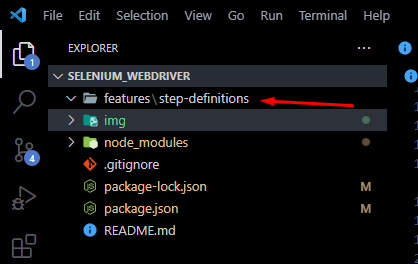
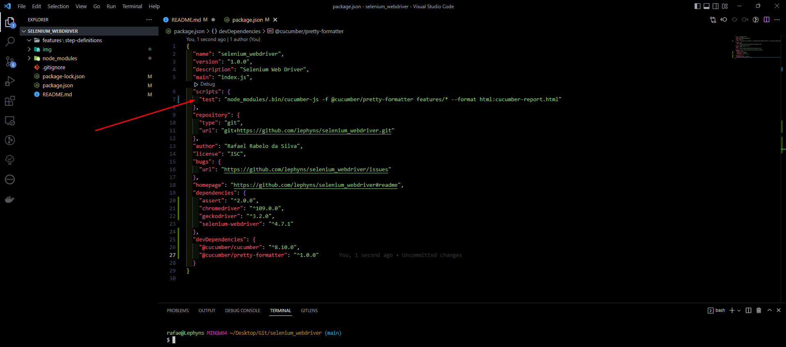

# O Projeto 📚

Projeto base de automação de testes com Selenium Web Driver e Cucumber. Neste projeto também foi adicionado a biblioteca pretty-formater que irá nos responder com as estruturas necessárias para integrar os testes dos arquivos com extensão "*.feature" em códigos JavaScript.

# Dependências ⚙️

* Selenium Web Driver
* Cucumber
* Biblioteca pretty-formater

# Passos para criar o projeto do zero 📌

**Passo 1:** iniciar um projeto NodeJs<br>
`$ npm init`

**Passo 2:** instalar Cucumber e pacotes auxiliares<br>
`$ npm install --save-dev @cucumber/pretty-formatter @cucumber/cucumber`

O @cucumber/pretty-formatter é uma biblioteca para facilitar a identificação/configuração do seu projeto cucumber e interface de testes. E a biblioteca @cucumber/cucumber é a versão completa de suporte a códigos BDD.

**Passo 3:** instalar o selenium-webdriver e assert (biblioteca de auxilio a verificações)<br>
`$ npm install selenium-webdriver assert`

**Passo 4:** instalar os drivers para os navegadores Chrome  e Firefox<br>
`$ npm install chromedriver geckodriver`

* chromedriver: driver do Chrome.
* geckodriver: driver do firefox.

Para verificar a versão basta fazer como no exemplo abaixo:<br>
`$ npm chromedriver -version`

**Passo 5:** criar estrutura de pastas do projeto<br>
  * Criar a pasta "features", para criar nossos arquivos BDD.
  * Criar pasta "step-definitions" dentro da pasta "features". Ela será utilizada para adicionar nossos arquivos de configuração dos testes.<br>

A estrutura final ficará assim:


**Passo 6:** adicionar no package.json o comando para execução e criação de relatório HTML<br>
Para isso, no item "scripts", para a variável "test" vamos editar o comando para a seguinte configuração:

```
  "scripts": {
    "test": "node_modules/.bin/cucumber-js -f @cucumber/pretty-formatter features/* --format html:cucumber-report.html"
  },
```

Com ele vamos executar os testes através do comando "npm test".

O arquivo ficará da seguinte forma:


**Passo 7:** criar os arquivos BDD (*.feature)<br>
Os arquivos em BDD devem estar dentro da pasta "features".

**Passo 8:** criar os arquivos de teste (Step tests *.JS)<br>
Os arquivos em javascript devem estar dentro da pasta "step_definitions".

**Passo 9:** executar os testes<br>
Para executar os testes basta digitar o comando abaixo no terminal:<br>
`$ npm test`